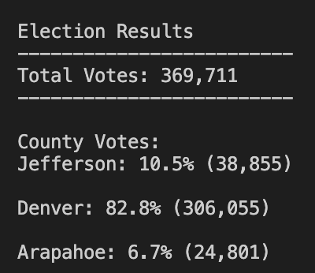
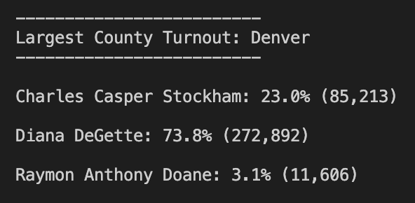
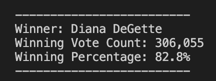

# Election_Analysis
## Project Overview
A CO Board of Elections employee has given me the following tasks to complete the election audit of a recent local congressional election

1. Calculate the total number of casted votes
2. Get a complete list of candidates who received votes
3. Calculate the total number of votes each candidate received
4. Calculate the percentage of votes each candidate won
5. Determine who the winner is

## Data Sources
Data Source: election_results.csv
Python 3.8.8

## Summary
Analysis of the election
* there were a total of 369,711 total votes casted
* The candidates were
* * Charles Casper Stockham
* * Diana DeGette
* * Raymon Anthony Doane
* The end results for each were
* * Charles Casper Stockham: 23.0% of votes received (85,213)
* * Diana DeGette: 73.8% of votes received (272,892)
* * Raymon Anthony Doane: 3.1% of votes received (11,606)
* The winner is
* * Diana DeGette: 73.8% of votes received (272,892)

## Challenge Overview
The purpose of the challenge was to see the county who voted the most. That way we can see which county is the most active when it comes to elections

## Challenge Summary
* There were a total of 369,711
* * Jefferson County casted 38,855 votes (or 10.5%)
* * Denver County casted 306,055 votes (or 82.8%)
* * Arapahoe County casted 24,801 votes (or 6.7%)
* * * Denver casted the most amount of votes with 306,055 (or 82.8% of the total votes)
* As stated above:
* * Charles Casper Stockham received 85,213 votes (or 23%)
* * Diana DeGette received 272,892 votes (or 73.8%)
* * Raymon Anthony Doane received 11,606 votes (or 11,606)
* * * Diana DeGette won the election with 272,892 votes (or 73.8% of the total votes)

## Suggestions
For future elections the python code can be modified with more or other counties to see their election results
* You would create a new list and/or dictionary with the extra and /or other counties
* You would also adjust the candidate dictionary and/or list to see the extra and/or other candidates from those counties too

## Accompanying Images
These images give you an overview of the election results visually

